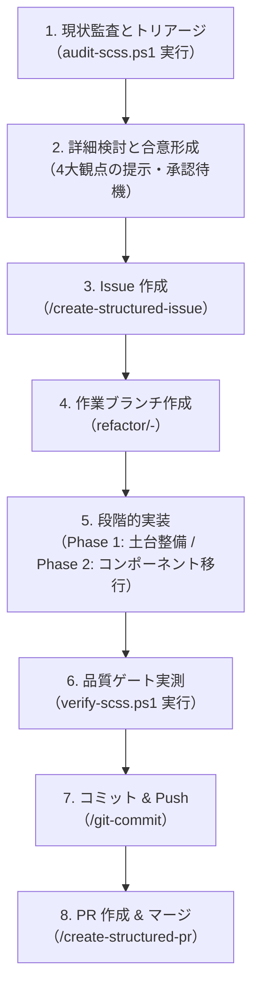

# SCSS Refactor Executor Workflow (`/scss-refactor-executor`)

## 目的

フロントエンド（Web Components / Lit アプリケーション）において、SCSSコードの重複解消、無効コードの排除、および設計標準化を**画面崩壊やリグレッションを起こさずに段階的に実行する**ための標準作業ワークフローです。

本ワークフローは、専用スキル `scss-refactor-tools`（現状監査・品質実測）および設計標準（3層判定基準・簡易BEM規約・アンチパターン抑止）と連動し、**「現状監査 → 4大観点合意 → Issue作成 → ブランチ作成 → 段階的実装 → 品質ゲート実測 → コミット & PR作成」** の一連のサイクルを安全かつ均一に進行します。

---

## CRITICAL CONSTRAINTS（厳格制約）

1. **フェーズ着手前の事前合意（4大観点の必須提示）**:
   - いかなる場合も、ユーザーとの対話形式による事前検討および合意形成（Approve）を経る前に、コード変更（SCSS、TypeScript、テストコード問わず）を開始してはならない。
   - 事前説明には、以下の **4つの観点** を必ず網羅して提示すること：
     - ① **現状の問題点**: 具体的にどのような重複やアンチパターンが生じているか（`audit-scss.ps1` の実測データに基づく）
     - ② **なぜその方針としたのか（設計判断の理由・Why）**: トークン化、Mixin化、コンポーネント抽出などのアプローチを採用する根拠
     - ③ **修正の効果**: 重複行数・トークンの削減、詳細度の平坦化、画面表示への影響範囲（表示崩壊リスクの有無）
     - ④ **将来的な拡張性の有無**: テーマ切り替え（ダーク/ライト）、新規コンポーネント追加時にどう安全に拡張できるか

2. **重複パターンの3層判定基準の厳格遵守**:
   - **レベル1（値の重複）**: カラー・余白等のリテラル値は `src/styles/tokens.scss` へ集約（CSSカスタムプロパティ化）。
   - **レベル2（パターンの重複）**: Flex配置・省略等の振る舞いは `src/styles/mixins.scss` へ集約（`@mixin` を使用。`@extend` は禁止）。
   - **レベル3（UIの重複）**: マークアップ構造とイベント処理が共通する場合は、SCSSで解決せず **Lit Web Component としてコンポーネント抽出**。

3. **禁止アンチパターンの完全排除**:
   - **`@extend` の完全禁止**: セレクタ結合によるカスケード破壊および Shadow DOM との非互換性を防ぐ。
   - **`!important` の完全禁止**: 詳細度戦争を根絶し、CSSカスタムプロパティによるテーマ切り替えを保護。
   - **深すぎるセレクタネスト（3階層以上）の禁止**: 最大2階層（原則1階層）に平坦化。
   - **タグ直指定セレクタの排除**: 必ず簡易BEMクラスを付与し、HTML構造変更に強いセレクタを構築。

4. **コンポーネント単位のボーイスカウト移行（ビッグバン移行の禁止）**:
   - アプリ全体の全SCSSを一括変更することは厳禁とする。改修対象コンポーネントから順に1つずつ確実に移行する。

5. **自律フェーズ移行の制限（ユーザー確認の絶対遵守）**:
   - 「監査提案 → Issue作成」「実装完了 → コミット」「コミット → PR作成」の各境界線は、エージェント自身の判断で越えてはならない。ユーザーの明示的な指示（「OK」「進めてください」等）のみが次のステップへのトリガーとなる。

6. **品質ゲート実測と検証結果の PR 明記**:
   - スキル `scss-refactor-tools` の `verify-scss.ps1` を実行し、単体テスト・型チェック・SCSS重複ゼロ・アンチパターンゼロ・単一HTMLビルドの全合格を実測数値で確認し、PR 本文の「検証結果」に明記すること。

---

## ワークフロー手順（標準8ステップサイクル）



---

### Step 1: 現状監査とトリアージ（Phase 0）

1. `git status` を実行し、作業ツリーがクリーンであることを確認する。
2. スキル `scss-refactor-tools` の監査スクリプトを実行する：
   ```powershell
   pwsh -File .agents/skills/scss-refactor-tools/scripts/audit-scss.ps1
   ```
3. 生成されたレポート（`.agents/scss-audit-report.json`）を確認し、優先度マトリクスに基づき着手対象をトリアージする：
   - **P1（最優先）**: ハードコード値のトークン化（`tokens.scss`）
   - **P2（高）**: 複数ファイル間のレイアウト重複（`mixins.scss`）
   - **P3（中）**: 特定コンポーネントの簡易BEM移行・ネスト平坦化
   - **P4（低）**: 1度しか出現しない特殊装飾（スコープ外）

---

### Step 2: フェーズ詳細検討と合意形成（4大観点の提示）

1. トリアージ結果に基づき、今回の作業スコープ（例: 「共通トークン・Mixinの土台確立」または「`pane-menu` の簡易BEM移行」）を決定する。
2. ユーザーへ以下の **4大観点** を提示し、対話形式で方針を合意する：
   - ① **現状の問題点**
   - ② **なぜその方針としたのか（設計判断の理由・Why）**
   - ③ **修正の効果**
   - ④ **将来的な拡張性の有無**
3. **ユーザーの明示的な承認（「OK」「進めてください」等）を待機する。**

---

### Step 3: Issue 作成（`/create-structured-issue`）

1. ワークフロー `/create-structured-issue` に従い、Issue 本文ドラフトを作成する。
2. **コンテキスト保護**: 本文の「補足情報」セクションに、`audit-scss.ps1` で検出された重複箇所（ファイル名、行番号、重複行数、トークン数）を必ず転記する。
3. ユーザーの承認を得た後、スキル `issue-create` で Issue を作成する。
4. 発行された Issue 番号（例: `#70`）を控える。

---

### Step 4: 作業ブランチの作成

1. `main` ブランチを最新化する（`git pull origin main`）。
2. スキル `create-branch-from-issue` 等を用いて作業ブランチを作成・チェックアウトする：
   ```powershell
   git checkout -b refactor/<issue-id>-<slug>
   ```

---

### Step 5: 段階的実装

作業スコープに応じて、以下のいずれかの手順で実装を進める。

#### パターン A: Phase 1（土台: Tokens & Tools の確立）の場合
1. ハードコード値を `src/styles/tokens.scss` へ CSS カスタムプロパティとして追記。
2. 汎用レイアウト（Flex中央揃え等）を `src/styles/mixins.scss` へ定義。
3. 既存 SCSS の該当値を `var(--token-name)` や `@include mixin` へ単値置換（**HTML構造・クラス名は変更しない**）。
4. ビルド成果物の出力差分を検証（同値性の保証）。

#### パターン B: Phase 2（コンポーネント単位のボーイスカウト移行）の場合
1. 対象コンポーネント（例: `pane-menu.ts` / `pane-menu.scss`）を特定。
2. TypeScript（Lit テンプレート）のクラス名を「簡易BEM」にリファクタリング。
3. ペア SCSS をリファクタリング（ネストを最大2階層に抑制、タグ直指定排除、トークン・Mixin適用）。
4. 開発サーバー（`npm run dev:stepnote`）やビルド成果物で画面を目視確認し、レイアウト崩れがないことを検証。

---

### Step 6: 品質ゲート実測（`verify-scss.ps1`）

スキル `scss-refactor-tools` の検証スクリプトを実行し、全ゲートの合格を実測する：

```powershell
pwsh -File .agents/skills/scss-refactor-tools/scripts/verify-scss.ps1 -OutputFile ".agents/scss-verify-report.json"
```

- **合格判定基準**:
  - `Unit Tests`: 全件パス、失敗 0 件
  - `Type Check`: 0 errors
  - `SCSS Clones`: 対象ブロックの重複が解消していること
  - `Anti-patterns`: `!important`, `@extend` が 0 件
  - `Standalone Build`: 単一 HTML の生成成功
- 不合格項目がある場合は原因を修正し、再実行して All Pass を達成する。

---

### Step 7: 変更のコミット & Push（`/git-commit`）

1. 対象ファイルをステージングする（`git add`）。
2. ワークフロー `/git-commit` に従い、Why（理由・設計判断）を明記したコミットメッセージドラフトを提示する。
3. ユーザーの承認を得た後、コミットを実行しリモートへ push する：
   ```powershell
   git push origin <branch-name>
   ```

---

### Step 8: PR 作成（`/create-structured-pr`）

1. ワークフロー `/create-structured-pr` に従い、PR ドラフトを作成する。
2. **検証結果の明記**: 本文の「## 検証結果」セクションに、Step 6 で出力された実測メトリクス（テスト件数、型チェック結果、重複クローン削減数、ビルド成果物サイズ）を記載する。
3. `Closes #<Issue番号>` を明記する。
4. ユーザーの承認を得た後、スキル `pr-create` で PR を作成する。
