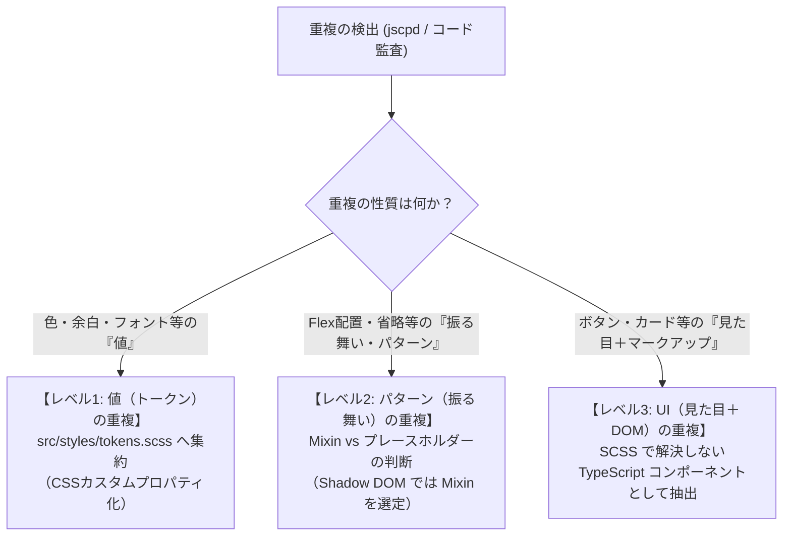

# SCSSリファクタリング・スキル定義書（Roles & Knowledge Specification）

## 1. 概要と本スキルの目的

本書は、フロントエンド開発（特に Web Components / Lit ベースのアプリケーション）において、SCSSコードの重複解消、無効・不要コードの排除、およびスタイリング設計の標準化を再現性をもって実行するための【スキル定義（知識基盤・判断基準・アンチパターン集）】である。

リファクタリングを担当するエンジニアおよびタスク実行AIは、本ドキュメントに定義された原則・判断基準・禁止事項を厳格に遵守してスタイル設計とコード改修を行わなければならない。

---

## 2. 前提アーキテクチャとスコープ

### 2.1 ハイブリッド型コロケーション（Colocation）
本プロジェクトでは、メンテナンス性と関心の分離を両立するため、以下のディレクトリ構成を採用する。

```
apps/stepnote/src/
├── styles/                          # 【グローバルレイヤー】全体共有
│   ├── tokens.scss                  # デザイントークン（CSSカスタムプロパティ群）
│   └── mixins.scss                  # 汎用 Mixin / 関数定義（純粋ヘルパー）
└── components/                      # 【コンポーネントレイヤー】コロケーション
    ├── panes/
    │   ├── pane-common.scss         # ペイン群共通スタイル
    │   ├── pane-menu/
    │   │   ├── pane-menu.ts         # TypeScript コンポーネント本体
    │   │   ├── pane-menu.scss       # コンポーネント固有スタイル（?inline で読み込み）
    │   │   └── pane-menu.test.ts    # 単体テスト
    │   └── pane-navigation/
    │       ├── navigation-quick-access.ts
    │       └── navigation-quick-access.scss
```

- **コンポーネント固有スタイル**:
  - 原則として `.ts` と同一階層に `.scss` を配置し、ペアで管理する。
  - コンポーネント外部へのスタイル漏洩は Shadow DOM により防ぎ、固有セレクタの管理を自己完結させる。
- **グローバルスタイル（`src/styles/`）**:
  - 全体で共有するデザイントークン（カラー、余白、タイポグラフィ、Z-index等）や純粋なレイアウトMixinのみを配置する。
  - 特定コンポーネントの個別セレクタをグローバルスタイルに記述することは厳禁とする。

### 2.2 Shadow DOM と CSS の境界設計
Lit を用いた Web Components 環境下では、以下の特性を前提としてスタイルを設計する。

| 特性 | 仕様・影響 | リファクタリング指針 |
| :--- | :--- | :--- |
| **セレクタのカプセル化** | コンポーネント内のセレクタは外部に漏れず、外部のセレクタも内側に届かない。 | 命名衝突を恐れて過度に長いプレフィックスを付ける必要はないが、構造把握のため「簡易BEM」を適用する。 |
| **CSS カスタムプロパティの透過** | `--*` 形式の変数は Shadow DOM の境界を貫通して子孫要素へ継承される。 | **グローバルな値の共有には CSS カスタムプロパティ（`tokens.scss`）を最優先で使用する。** |
| **`@extend` のスコープ閉鎖** | SCSSの `@extend` はコンパイル単位（単一ファイル内）でのみ結合され、別コンポーネント間では共有できない。 | **コンポーネントを跨ぐ `@extend` は動作しないため、Mixin またはトークンで解決する。** |

---

## 3. 重複パターンの分類基準と対処原則

重複（Duplication）を発見した際、安易にすべてを共通クラスや Mixin に逃がすことは設計の結合度を高める原因となる。以下の「3層判定フロー」に従って適切な階層へ集約する。



### 3.1 レベル1: 値（トークン）の重複
- **対象**: カラーコード（`#1f2328`, `#0969da`）、余白（`8px`, `12px`）、フォントサイズ、ボーダー半径、z-index などのリテラル値。
- **対処原則**:
  - `apps/stepnote/src/styles/tokens.scss` に集約する。
  - Web Components 間で透過共有するため、SCSS 変数（`$color-brand`）ではなく **CSS カスタムプロパティ（`--wa-*`, `--stepnote-*`）** として定義する。
  - 各コンポーネント内では直接のカラーコードを排除し、`var(--stepnote-header-height)` のようにトークンを参照する。
- **多層構造のトークン設計**:
  ```scss
  /* tokens.scss の定義例 */
  :root {
    /* 1. Global / Primitive Tokens（基本値） */
    --stepnote-color-blue-60: #0969da;
    --stepnote-space-sm: 8px;

    /* 2. Semantic / Role Tokens（文脈・意味値） */
    --stepnote-color-action-primary: var(--stepnote-color-blue-60);
    --stepnote-pane-menu-padding: var(--stepnote-space-sm);
  }
  ```

### 3.2 レベル2: パターン（振る舞い・レイアウト）の重複
- **対象**:
  - Flexbox による中央揃え（`display: flex; align-items: center; justify-content: center;`）
  - スクロールバーのカスタマイズ（`scrollbar-width`, `&::-webkit-scrollbar`）
  - 1行テキストの末尾省略（`overflow: hidden; text-overflow: ellipsis; white-space: nowrap;`）
  - フォーカスリングの視覚表現（`outline`, `box-shadow`）

#### 【重要】Mixin vs プレースホルダー（`%placeholder` / `@extend`）の判断基準
Web Components / Shadow DOM 環境において、プレースホルダーおよび `@extend` はカスケード崩壊とバグの温床となる。以下の比較マトリクスに基づき、**原則として `@mixin` を使用する**。

| 比較項目 | `@mixin` | `%placeholder` + `@extend` | Shadow DOM 環境での推奨 |
| :--- | :--- | :--- | :--- |
| **コンパイル後CSS** | 呼び出し箇所ごとに宣言が複製展開される。 | セレクタがカンマ区切りで結合される（`.a, .b { ... }`）。 | **`@mixin`**: Shadow DOM では各コンポーネントが独立した `<style>` を持つため、カンマ結合の恩恵を受けられない。 |
| **スコープ境界** | `@use` 経由でどこからでも安全に展開可能。 | 同一コンパイル単位外へは extend できない。 | **`@mixin`**: コンポーネントを跨ぐ共有でエラーや無効化が発生しない。 |
| **引数のサポート** | 対応（引数による柔軟な制御が可能）。 | 非対応（静的な宣言群のみ）。 | **`@mixin`**: 微妙な差異（padding量、行数など）を引数で吸収可能。 |
| **セレクタ詳細度** | 呼び出し先のセレクタ詳細度をそのまま維持。 | セレクタ結合により意図せず詳細度やカスケード順が変化する。 | **`@mixin`**: 詳細度インフレや優先順位狂いを確実に防止できる。 |

```scss
/* 推奨: src/styles/mixins.scss */
@mixin flex-center {
  display: flex;
  align-items: center;
  justify-content: center;
}

@mixin text-ellipsis {
  overflow: hidden;
  text-overflow: ellipsis;
  white-space: nowrap;
}

/* 使用例: pane-menu.scss */
@use "../../../styles/mixins.scss" as m;

.pane-menu__toggle-btn {
  @include m.flex-center;
}
```

### 3.3 レベル3: UI（見た目＋マークアップ）の重複
- **対象**:
  - アイコン付きトグルボタン
  - セクションヘッダー（アイコン＋タイトル＋開閉ボタン）
  - ステータスラベル・バッジ
- **判断基準（SCSSで共通化してはならない境界線）**:
  - 「SCSSのコード行数を減らしたい」という理由だけで、全く異なるコンポーネントから同一のクラス名（例: `.section-header`）を無理やり参照させてはならない。
  - **以下の条件に2つ以上該当する場合は、SCSSではなく TypeScript（Lit コンポーネント）として共通コンポーネントを抽出する**:
    1. HTMLテンプレートの構造（DOM要素のネスト順序）が完全に一致している。
    2. クリックイベント、開閉状態フラグ（`aria-expanded`, `is-open` 等）のJavaScriptロジックが共通している。
    3. 将来的にレイアウトやマークアップの仕様変更があった場合、両方の画面で同時に更新されるべきビジネス上の理由がある。

---

## 4. 禁止・警戒すべきアンチパターン集

リファクタリング時、以下のアンチパターンを検出した場合は即座に修正対象とし、新規コードへの混入を厳格に排除する。

### アンチパターン 1: カスケード崩壊を招く安易な `@extend`
- **問題点**:
  - セレクタ結合により、ソースコード上の記述順とコンパイル後のカスケード優先度が乖離する。
  - Web Components ごとにバンドルされる際、未使用セレクタの肥大化や結合不能エラーの原因となる。
- **規約**:
  - **`@extend` の使用を全面的に禁止とする。** パターンの共通化は必ず `@mixin` またはデザイントークンで行う。

### アンチパターン 2: `!important` による優先度上書き
- **問題点**:
  - `!important` を使うと、そのプロパティをさらに上書きするために別の `!important` が必要になり、「詳細度戦争」が勃発する。
  - ダークモード/ライトモードのテーマ切り替え（カスタムプロパティによる動的値解決）を阻害する。
- **規約**:
  - **`!important` の使用を全面的に禁止とする。**
  - スタイルが当たらない場合は、セレクタの詳細度を見直すか、Shadow DOM 内のスコープ構造を整理して解決する。

### アンチパターン 3: 深すぎるセレクタネスト（3階層以上）
- **問題点**:
  - ネストが深くなるほど生成されるCSSの詳細度が高くなり、再利用や状態クラスでの上書きが困難になる。
  - HTMLの構造変更（`div` を1枚挟むなど）で容易にスタイルが壊れる。
- **規約**:
  - **ネストの深さは最大2階層まで（原則1階層）とする。**
  - 状態クラス（`.is-active` 等）や擬似クラス（`:hover`）の結合を除き、子孫セレクタの入れ子は原則排除する。

```scss
/* 🔴 違反例: 深すぎるネストと詳細度インフレ */
.pane-navigation {
  .nav-section {
    .section-list {
      li {
        a {
          color: red; /* 5階層: 保守不能 */
        }
      }
    }
  }
}

/* 🟢 是正後: 簡易BEMによるフラット設計（最大2階層） */
.nav-section {
  &__link {
    color: var(--stepnote-color-link);

    &.is-active {
      color: var(--stepnote-color-link-active);
    }
  }
}
```

### アンチパターン 4: タグ直指定セレクタ（要素セレクタ）の乱用
- **問題点**:
  - `div`, `span`, `ul`, `li`, `button` などのHTMLタグを直接セレクタに指定すると、意図しない子孫要素にスタイルが波及する。
- **規約**:
  - **スタイル適用の対象要素には必ず明確なクラス（BEM）を付与する。**
  - リセット目的の `:host` 直下定義や、マークダウンレンダラー（`marked` 等）内の動的生成コンテンツを除き、タグ単体セレクタの記述を禁止する。

### アンチパターン 5: マジックナンバーとカラーリテラルの直書き
- **問題点**:
  - `#30363d` や `13px` などの値が各所に散らばると、デザイン変更やテーマ対応時に漏れが発生する。
- **規約**:
  - すべてのカラー、余白、タイポグラフィ、ボーダーは `src/styles/tokens.scss` のトークンを参照する。

---

## 5. 簡易BEM命名規則とセレクタ設計規約

本プロジェクトでは、詳細度の均一化と認知負荷軽減のため、厳格すぎるBEMではなく**「簡易BEM（Simplified BEM）」**を採用する。

### 5.1 基本フォーマット
- **Block**: コンポーネントまたは独立したUIブロック名（kebab-case）
  - 例: `pane-menu`, `nav-labels`, `task-item`
- **Element**: Blockを構成する子要素（`__` で接続、階層化しない）
  - 例: `pane-menu__item`, `pane-menu__icon`, `task-item__title`
  - ※禁止: `pane-menu__item__icon`（孫要素の `__` 連結は禁止。常にBlock直属として命名する）
- **Modifier / State**: 状態やバリエーション（`--` または状態プレフィックス `is-`）
  - バリエーション例: `task-item--compact`, `btn--primary`
  - 状態例: `is-open`, `is-active`, `is-disabled`, `is-selected`

### 5.2 SCSS記述テンプレート
```scss
/* ==========================================================================
   Component: PaneMenu (pane-menu.scss)
   ========================================================================== */
@use "../../../styles/tokens.scss";
@use "../../../styles/mixins.scss" as m;

:host {
  display: flex;
  flex-direction: column;
  height: 100%;
  overflow: hidden;
  background-color: var(--wa-color-surface-default);
}

/* Block */
.pane-menu {
  display: flex;
  flex-direction: column;
  gap: var(--wa-space-xs);

  /* Element */
  &__button {
    @include m.flex-center;
    width: 36px;
    height: 36px;
    border-radius: var(--wa-border-radius-m);
    color: var(--wa-color-text-quiet);
    transition: background-color 0.2s ease, color 0.2s ease;

    &:hover {
      background-color: var(--wa-color-surface-hover);
      color: var(--wa-color-text-normal);
    }

    /* State / Modifier */
    &.is-active {
      color: var(--wa-color-brand-60);
      background-color: var(--wa-color-brand-subtle);
    }
  }

  &__icon {
    width: 20px;
    height: 20px;
  }
}
```

---

## 6. 効果測定台帳（`scss-refactor-backlog.json`）の管理基準

リファクタリングの投資対効果（ROI）を定量的かつ客観的に追跡するため、TypeScript コードベースと同様に SCSS 専用の効果測定台帳（`.agents/scss-refactor-backlog.json`）を運用する。

### 6.1 台帳の役割とライフサイクル
1. **課題の同定・登録 (`status: "pending"`)**:
   - `audit-scss.ps1` の実測データに基づき、課題 ID（`SCSS-001` 等）、対象ファイル、事前メトリクス（重複行数、トークン数、`!important` 数、最大ネスト階層）を記録する。
2. **作業単位での着手 (`status: "in_progress"`)**:
   - Issue 作成および作業ブランチ作成を行い、該当アイテムに着手する。
3. **品質検証と実績記録 (`status: "completed"`)**:
   - `verify-scss.ps1 -UpdateBacklog -BacklogId <ID>` を実行し、全ゲート合格時に事後メトリクス（`metrics_after`）、関連 Issue / PR / コミットハッシュを自動記録する。

### 6.2 スキーマ構造
```json
{
  "id": "SCSS-001",
  "target_file": "apps/stepnote/src/styles/tokens.scss",
  "target_selector": ":root / .wa-dark",
  "category": "Tokenization",
  "metrics": {
    "duplicated_tokens_defined": 67,
    "files_involved": 3
  },
  "issue_summary": "課題の概要",
  "approach": "改善方針",
  "scope": "shared | component | internal",
  "risk_level": "Low | Medium | High",
  "feasibility": "High | Medium | Low",
  "status": "pending | in_progress | completed",
  "execution": {
    "completed_at": "ISO 8601 日時",
    "issue_number": 75,
    "pr_number": 76,
    "commit_hash": "7桁コミットハッシュ",
    "tests_passed": 383,
    "regressions_detected": 0,
    "metrics_after": {
      "clones": 0,
      "duplicated_lines": 0,
      "duplicated_tokens": 0,
      "anti_pattern_errors": 0,
      "build_size_kb": 583.49
    }
  }
}
```
