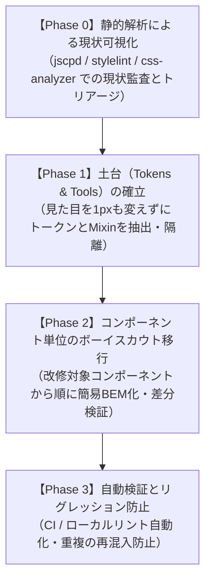
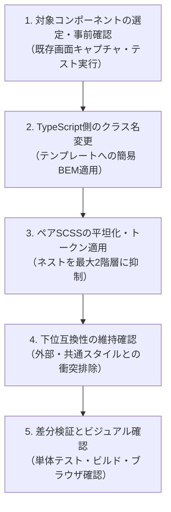

# 再現性のあるSCSSリファクタリング標準ワークフロー仕様書（Actionable Steps Guide）

## 1. ワークフロー概要と全体像

本書は、フロントエンド開発においてSCSSコードの重複解消、無効コードの排除、および設計標準化を**画面崩壊やリグレッション（先祖返り）を起こさずに段階的に実行する**ための標準作業手順書である。

本ワークフローは以下の4フェーズで構成され、各フェーズを厳格に順守して進める。



---

## 2. Phase 0: 静的解析による現状可視化（現状監査）

リファクタリングに着手する前に、勘や目視に頼らず、ツールによる客観的データに基づいてコードベースの健康度を測定し、改修優先度（トリアージ）を決定する。

### 2.1 解析ツール群の実行コマンド（PowerShell対応）

#### ① 重複ブロックの検出（`jscpd`）
SCSSファイル直接解析を行い、類似・重複している宣言ブロックを抽出する。

```powershell
# SCSSファイルの重複検出実行（mild モード: 空白・改行の差異を許容）
npx jscpd apps/stepnote/src `
  --pattern "**/*.scss" `
  --mode mild `
  --min-lines 5 `
  --min-tokens 20 `
  --reporters console,json `
  --output .agents/jscpd-scss-report
```

- **レポートの見方**:
  - `Total duplicated lines`: プロジェクト全体での重複行数
  - `Clones count`: 重複ブロックのペア数
  - 出力された JSON（`.agents/jscpd-scss-report/jscpd-report.json`）から、同一ファイル内または別ファイル間でコピー＆ペーストされているCSSプロパティ群を特定する。

#### ② 構文違反・詳細度インフレの検知（`stylelint` + `stylelint-scss`）
深すぎるネストや `!important`、タグ直指定セレクタを検出する。

- **設定ファイル例（`.stylelintrc.json`）**:
```json
{
  "plugins": ["stylelint-scss"],
  "rules": {
    "max-nesting-depth": 2,
    "declaration-no-important": true,
    "at-rule-disallowed-list": ["extend"],
    "selector-max-type": [0, { "ignore": ["child", "compounded"] }],
    "scss/at-rule-no-unknown": true,
    "scss/selector-no-redundant-nesting-selector": true
  }
}
```

- **実行コマンド**:
```powershell
npx stylelint "apps/stepnote/src/**/*.scss" --formatter verbose
```

#### ③ ビルド後CSSの複雑度・詳細度・値の分散分析（`@projectwallace/css-analyzer`）
実際にバンドル・展開されたCSSのASTを解析し、ユニークカラー数や詳細度（Specificity）の分布を測定する。

```powershell
# 1. stepnote アプリケーションをビルド
npm run build:stepnote

# 2. 生成されたHTML（単一ファイル）内の style タグまたは抽出CSSを解析
node -e @"
const fs = require('fs');
const { analyze } = require('@projectwallace/css-analyzer');
const html = fs.readFileSync('apps/stepnote/dist/index.html', 'utf8');
const cssMatch = html.match(/<style[^>]*>([\s\S]*?)<\/style>/);
if (cssMatch) {
  const stats = analyze(cssMatch[1]);
  console.log('--- CSS Analysis Report ---');
  console.log('Rules Count:', stats.rules.total);
  console.log('Selectors Count:', stats.selectors.total);
  console.log('Max Specificity:', stats.selectors.specificity.max);
  console.log('Unique Colors Count:', stats.values.colors.unique);
  console.log('Unique Font Sizes:', stats.values.fontSizes.unique);
}
"@
```

#### ④ 不要セレクタの分析（`purgecss` 検証モード）
TypeScript / HTML テンプレート内で実際に参照されていない無効セレクタを検出する。

```powershell
npx purgecss `
  --css "apps/stepnote/src/**/*.scss" `
  --content "apps/stepnote/src/**/*.ts" `
  --rejected
```

---

### 2.2 優先度トリアージ基準（Impact vs Risk Matrix）

検出された課題は、以下のマトリクスに基づいて着手順序を決定する。

| 優先度 | 課題カテゴリ | 判定基準 | 理由・アクション |
| :---: | :--- | :--- | :--- |
| **P1<br/>（最優先）** | **値の分散・ハードコード** | カラー・余白・フォントサイズのリテラル直書き | ロジックやセレクタを触らないため、**表示崩壊のリスクが極小**。トークン化を先行実施する。 |
| **P2<br/>（高）** | **単純なレイアウト重複** | 3箇所以上で完全一致する Flex/中央揃え等のブロック | Mixin への抽出により安全に重複行を劇的に削減可能。 |
| **P3<br/>（中）** | **セレクタネスト・簡易BEM化** | ネスト深さ3階層以上、タグ直指定セレクタ | TypeScript側のクラス名変更が伴うため、**コンポーネント単位でボーイスカウト移行**する。 |
| **P4<br/>（低）** | **1箇所のみの特殊スタイル** | 出現頻度が1回の装飾スタイル | 共通化の価値が低いため、リファクタリング対象外とする。 |

---

## 3. Phase 1: 土台（Tokens & Tools）の確立

**【ゴール】既存画面のレンダリング結果（ピクセル単位）を1ミリも変更せず、共通トークンおよびMixin基盤を整備する。**

### 3.1 手順

#### Step 1: ハードコード値の抽出と棚卸し
- Phase 0 の `@projectwallace/css-analyzer` レポートから、プロジェクト内で使用されているユニークカラー、フォントサイズ、余白のリストを抽出する。
- 類似色（例: `#0969da` と `#0a6cd8` など）や微小なズレをまとめ、プロジェクトのデザインシステム（Web Awesome トークン）に適合するトークン名を決定する。

#### Step 2: `src/styles/tokens.scss` の更新・拡充
- 抽出した値を CSS カスタムプロパティとして `tokens.scss` の `:root`（およびダークモード `:root.wa-dark`）に追記する。

```scss
/* apps/stepnote/src/styles/tokens.scss */
:root {
  /* 既存トークン ... */

  /* 新規抽出トークン: 共通寸法・余白 */
  --stepnote-item-height-sm: 32px;
  --stepnote-item-height-md: 40px;
  --stepnote-border-radius-card: 6px;
}
```

#### Step 3: 共通ヘルパー `src/styles/mixins.scss` の新設
- 複数コンポーネントで繰り返されている汎用パターン（Flexbox配置、テキスト省略等）を Mixin として定義する。

```scss
/* apps/stepnote/src/styles/mixins.scss */
@mixin flex-center {
  display: flex;
  align-items: center;
  justify-content: center;
}

@mixin flex-between {
  display: flex;
  align-items: center;
  justify-content: space-between;
}

@mixin text-ellipsis {
  overflow: hidden;
  text-overflow: ellipsis;
  white-space: nowrap;
}
```

#### Step 4: 値の単値置換（1対1リプレイス）
- 各コンポーネントの SCSS 内でハードコードされている値を `var(--token-name)` や `@include mixin` へ置換する。
- **※注意: このフェーズでは HTML のクラス名やセレクタ構造は一切変更しないこと。**

#### Step 5: 同値性検証（差分ゼロ確認）
- リプレイス前後のビルド成果物を比較し、CSS の出力値が同一であることを確認する。

```powershell
# ビルド実行
npm run build:stepnote

# テスト実行（既存のコンポーネント振る舞いを壊していないか）
npm test
```

---

## 4. Phase 2: コンポーネント単位のボーイスカウト移行

**【ゴール】機能開発やバグ修正の機会に合わせて、対象コンポーネントを1つずつ「簡易BEM」および「フラットセレクタ設計」へ刷新する。**

> **ボーイスカウトルール**: 「自分が訪れた場所を、去る時には来た時よりも美しくする」。
> アプリ全体の全SCSSを一括変更する「ビッグバン・リファクタリング」は絶対に避け、触るコンポーネントから確実に1つずつ移行する。

### 4.1 手順（1コンポーネントの移行サイクル）



#### Step 1: 事前確認
- 対象コンポーネント（例: `pane-menu.ts` / `pane-menu.scss`）を特定する。
- 既存の単体テスト（`pane-menu.test.ts`）を実行してパスすることを確認する。

#### Step 2: TypeScript（Lit テンプレート）のクラス名変更
- テンプレート内の class 指定を「簡易BEM」にリファクタリングする。
- 動的クラス切り替え（`classMap` 等）のキー名を新しい BEM 状態クラス（`is-active`, `is-open` 等）に更新する。

```typescript
// 変更前（レガシー・タグ依存）
render() {
  return html`
    <div class="menu-primary">
      <button class="btn-toggle-sidebar" @click=${this.toggle}>
        <span class="icon-toggle-sidebar ${this.isOpen ? 'is-open' : 'is-closed'}">▼</span>
      </button>
    </div>
  `;
}

// 変更後（簡易BEM準拠）
render() {
  return html`
    <nav class="pane-menu__primary" aria-label="Primary navigation">
      <button 
        type="button"
        class="pane-menu__btn-toggle" 
        aria-expanded=${this.isOpen}
        @click=${this.toggle}
      >
        <span class="pane-menu__toggle-icon ${this.isOpen ? 'is-open' : 'is-closed'}">▼</span>
      </button>
    </nav>
  `;
}
```

#### Step 3: SCSS のリファクタリング（平坦化とトークン適用）
- ネストを最大2階層までに平坦化する。
- タグ直指定を排除し、BEM セレクタへ変更する。
- `src/styles/mixins.scss` や `src/styles/tokens.scss` をインポートして適用する。

```scss
/* pane-menu.scss */
@use "../../../styles/tokens.scss";
@use "../../../styles/mixins.scss" as m;

:host {
  display: flex;
  flex-direction: column;
  height: 100%;
}

.pane-menu {
  &__primary {
    @include m.flex-center;
    flex-direction: column;
    gap: var(--wa-space-2xs);
    width: 100%;
  }

  &__btn-toggle {
    @include m.flex-center;
    cursor: pointer;
  }

  &__toggle-icon {
    display: inline-block;
    transition: transform 0.2s ease;

    &.is-open {
      transform: rotate(0deg);
    }

    &.is-closed {
      transform: rotate(90deg);
    }
  }
}
```

#### Step 4: 既存レガシー・外部依存との共存テクニック
- もし親コンポーネントやグローバルCSSから古いクラス名を参照している可能性がある場合は、移行期間中のみカンマ区切りで旧クラス名へのエイリアスを残す。
  ```scss
  /* 移行期間中の暫定エイリアス（不要になり次第削除） */
  .pane-menu__btn-toggle,
  .btn-toggle-sidebar {
    @include m.flex-center;
  }
  ```

#### Step 5: 差分検証（ビジュアル確認＆テスト）
- 単体テストのパス確認: `npm test`
- 型チェックのパス確認: `npm run type-check`
- 単一HTMLビルドの成功確認: `npm run build:stepnote`
- 開発サーバー（`npm run dev:stepnote`）またはビルド成果物をブラウザで開き、レイアウト崩れやスタイルの脱落がないことを目視確認する。

---

## 5. Phase 3: 自動検証とリグレッション防止

**【ゴール】リファクタリング後のクリーンな状態を維持し、将来の開発で再び重複やアンチパターンが混入することをCIおよびローカル環境で自動的にブロックする。**

### 5.1 `package.json` スクリプトの拡充

モノレポルートの `package.json` に、SCSS 向けの監査・リントスクリプトを追加する。

```json
{
  "scripts": {
    "lint:scss": "stylelint \"apps/stepnote/src/**/*.scss\"",
    "lint:scss:fix": "stylelint \"apps/stepnote/src/**/*.scss\" --fix",
    "audit:scss-clones": "jscpd apps/stepnote/src --pattern \"**/*.scss\" --mode mild --threshold 0",
    "audit:css-stats": "node scripts/analyze-css-stats.mjs"
  }
}
```

### 5.2 CI（GitHub Actions）への組み込み

プルリクエスト（PR）作成時に自動実行されるワークフロー（`.github/workflows/ci.yml` など）へ、SCSSの品質チェックステップを組み込む。

```yaml
# .github/workflows/ci.yml の抜粋
- name: Run SCSS Linter
  run: npm run lint:scss

- name: Check SCSS Duplication (jscpd)
  run: npm run audit:scss-clones
```

- これにより、以下の違反を含むPRは自動的に CI で失敗（ブロック）する：
  1. ネストの深さが3階層以上の SCSS
  2. `!important` または `@extend` の記述
  3. 新たに作成された重複ブロック（`jscpd` のしきい値超過）

---

## 6. トラブルシューティング & ロールバック基準

| 発生事象 | 原因 | 対処方法 |
| :--- | :--- | :--- |
| **スタイルが当たらない** | Shadow DOM 内でのセレクタ詳細度不足、またはクラス名のタイプミス | ブラウザの開発者ツールで要素をインスペクトし、セレクタが一致しているか確認する。親要素に無駄な詳細度がないか点検する。 |
| **CSS カスタムプロパティが反映されない** | `:root` スコープでの定義漏れ、またはスペルミス | `var(--wa-color-*, fallback)` のようにフォールバック値を指定しつつ、`tokens.scss` 内のプロパティ名と完全一致しているか確認する。 |
| **画面のレイアウトが崩れた** | Flexbox/Grid の親コンテナ設定（`overflow: hidden` や `min-height: 0`）の欠落 | Git のコミット単位をコンポーネント単位にしておくことで、問題が発生したコンポーネントのコミットのみを安全にリバート（`git revert`）する。 |
